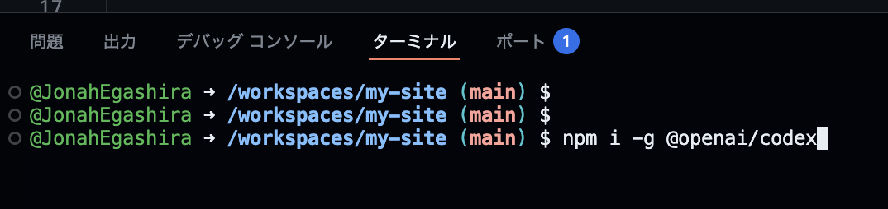
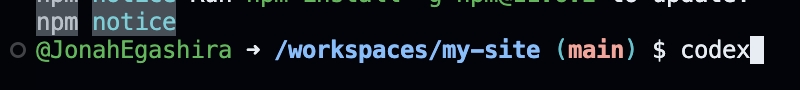
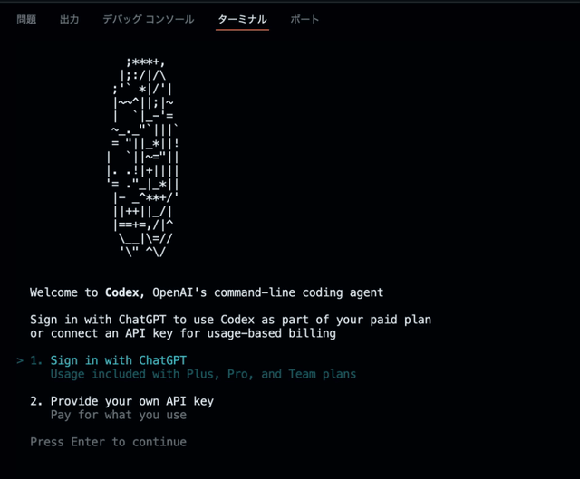
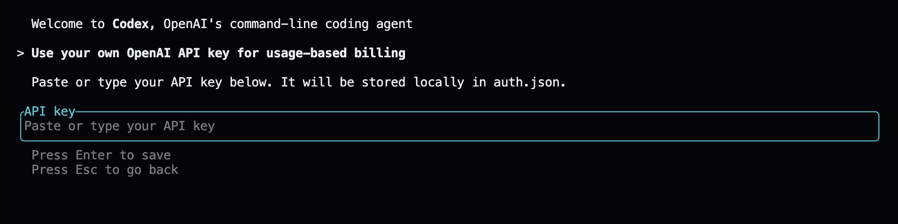
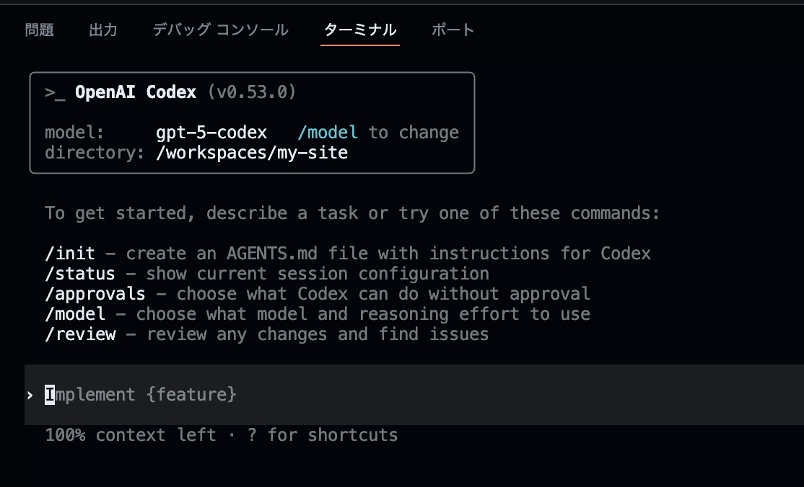
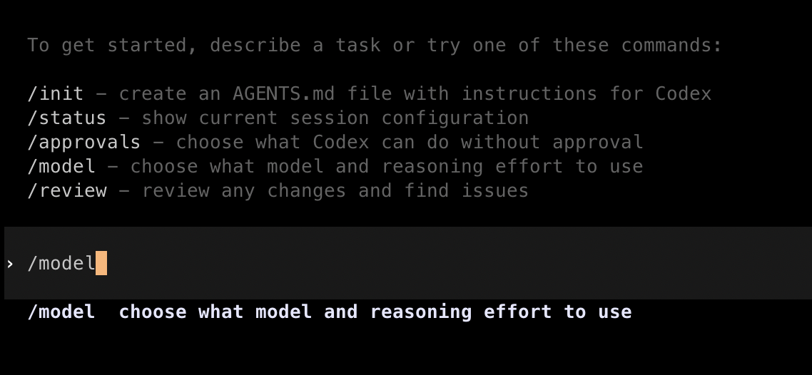
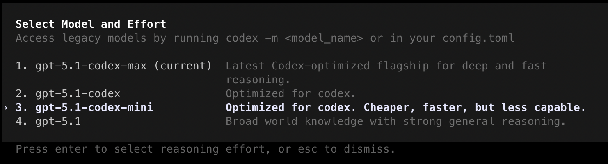
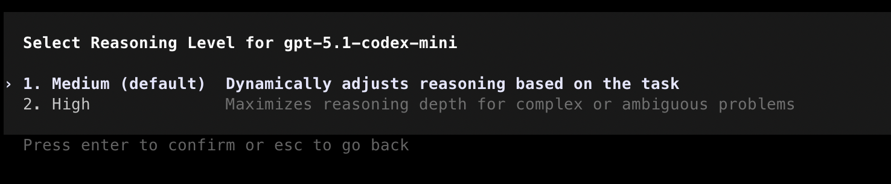

# 開発環境の準備

本講義中は、GitHub Codespacesを用いてCodex CLIを利用します。
GitHub Codespacesは、クラウド上で開発環境を提供するサービスで、ブラウザーだけで開発環境を利用できます。
これにより、インストールやセットアップの手間を省き、すぐに開発を始めることができます。

---

# GitHub Codespacesとは

GitHubが提供するクラウドの開発環境です。
[GitHub Codespaces](https://github.co.jp/features/codespaces)

* **環境構築不要**
  通常、プログラミングや開発を行う際は複数のツールをインストールする必要がありますが、Codespaces上のマシンには主要なツールがすでにインストールされています。
  自分のPCには何もインストールしなくても、すぐに開発を始められます。

* **どのPCでも同じ環境**
  クラウド上で開発を行うことができるため、個人のPCの設定などに左右されず、チーム全員が同じ設定で作業できます。

---

## GitHub Codespacesでの作業手順

まずはじめに、GitHubでリポジトリを作成しましょう。

### GitHub リポジトリを新規作成

* リポジトリとは、Gitで管理しているフォルダー、ディレクトリのことです。

<details markdown="1">
<summary>補足：💡フォルダー、ディレクトリ、リポジトリの違い</summary>

### **フォルダー**

* パソコンの中でファイルを入れる「入れ物」
* 物理的なディレクトリ構造の見た目のこと

---

### **ディレクトリ**

* フォルダーとほぼ同じ意味ですが、**コンピューター用語寄り**
* ターミナルやコマンドラインで「今いる場所」を指すときに「ディレクトリ」と言う
* 例：`cd my-site` は「my-site」というディレクトリに移動するという意味です。

---

### **リポジトリ（Repository）**

* Gitで管理されているフォルダー（＋その中の履歴データ）
* 普通のフォルダーとの違いは「中に `.git` という隠しフォルダーがあり、過去の履歴や設定が入っている」こと
* GitHubにアップすると、そのままインターネット上のリポジトリにもなります。

</details>

1. [GitHub にログイン](https://github.com/login)し、右上の「＋」→ [**New repository**](https://github.com/new) をクリック
   
2. Repository name に任意の名前（例：`my-site`）を入力し、`Add README` をオンにして、**Create repository** をクリックします。
   

---

### Codespaceを起動

1. 作成したリポジトリのトップページがこのようになっていることを確認します。
   
2. 右上の「＋」→ **New Codespace** をクリックします。
   
3. Codespace作成の設定画面に移行するので、Repositoryから先ほど作成したリポジトリを選択します。その他の設定はデフォルトのままでOKです。**Create codespace**をクリックします。
   

作成から起動までに1〜3分ほどかかる場合があります。ブラウザーは閉じずにそのまま待ちましょう。

<details markdown="1">
<summary>Codespacesの料金について</summary>

Codespacesは毎月一定量まで無料で使用することができます。
個人用のGitHubアカウントには、月あたり15GBのストレージと、120コア時間の使用時間が付与されます。
コア時間は使用するマシンのスペックによって消費量が異なります。
2コアマシンを1時間使うと2コア時間を消費し、8コアマシンを1時間使うと8コア時間という計算です。
詳しくは[GitHub Codespacesの料金について](https://docs.github.com/ja/billing/concepts/product-billing/github-codespaces)をご確認ください。

</details>

---

## Codespacesの画面構成

GitHub Codespacesは、クラウド上で動作するVS Code（Visual Studio Code）です。
VS Codeは、Microsoftが提供する無料のソースコードエディターで、多くのプログラミング言語をサポートし、拡張機能を通じて機能を追加することができます。

Codespaces/VS Codeの画面構成について簡単に説明します。


1. **ファイルエクスプローラー**
   左側に表示されるファイルエクスプローラーは、プロジェクト内のファイルやフォルダーを表示します。ここからファイルをクリックすることで、エディターで開くことができます。

2. **エディター**
   画面中央に位置するエディターは、コードを編集するための領域です。シンタックスハイライトやコード補完機能が利用でき、効率的にコードを書くことができます。

3. **ターミナル**
   画面下部に表示されるターミナルは、コマンドを実行するためのインターフェースです。ここでGitコマンドやnpmコマンドを実行して、プロジェクトの管理やビルドを行うことができます。

---

# Codex CLIのインストール

それでは実際にCodespaces上でCodex CLIを動かしてみましょう。

まず、Codespacesのターミナルで以下のコマンドを実行し、Codex CLIをインストールします。
実行は、このコマンドをターミナルに入力（コピー＆ペースト）し、Enterキーを押すことでできます。

```bash
npm i -g @openai/codex
```

このコマンドで、Codex CLIがCodespaces上のマシンにグローバルにインストールされます。



---

# Codex CLIの起動

インストールが完了したら、以下のコマンドでCodex CLIを起動します。

```bash
codex
```

実行すると、以下のように回転するロゴが表示されます。





ここで、2. の **Provide your own API key**を選択しましょう。
ChatGPTに課金している方は 1. の Sign in with ChatGPT を選択してください（課金プランの範囲内で利用でき、追加の料金を取られることはありません）

### ChatGPTの課金プランを利用する人へ
GitHub Codespacesで、ChatGPTアカウントを使ってサインインする時に、少し工夫が必要になります。
以下の記事を参考に（講義中でも紹介します）サインインしてください。

[GitHub Codespaces上でCodex CLIのライセンスを認証する方法](https://zenn.dev/haru_iida/articles/sign_in_codex_with_codespaces)



ここの**API key**と書いてあるところに、APIキーをペーストしましょう。
APIキーは[掲示板](https://lecture-board.jonah-342.workers.dev/)から取得できます。



成功すると、上記のような画面になります。
失敗する場合はもう一度APIキーをペーストし直してみてください。

# 重要：モデルの選択

一昔前はGPT-4oだったのが、いまはGPT-5.1になっているように、Codexでも複数のモデルが存在します。
本講習ではWebページの制作という比較的シンプルな作業をおこなうので、高速かつコスト効率のよいモデルを選択します。

Codexを起動している画面で、

```
/model
```

と入力してください。



すると、このようにどのモデルを選択するかの画面が出てきます。
`gpt-5.1-codex-mini` を選択（キーボードの上下矢印キーで移動）し、Enterキーを押します。



すると、Reasoning Levelの選択画面に移ります。
Reasoningとは、AIが考えるプロセスのことであり、ReasoningのLevelを上げると、AIがより多く考えて良い答えが返ってくる可能性が高まります。

しかし、静的なWebサイトのコーディングにはそこまでの「考える」プロセスは必要ないので、`default`を選択します。



<details markdown="1">
<summary>どんな時にReasoningが必要？</summary>
以下のようなケースでは、Reasoningがあるとより良い結果を得られやすいです。

- バグの原因特定
- アルゴリズムの設計・選定
- コードレビューでの問題発見
- 複雑なデータ分析
- 数学の問題

Reasoningをおこなうようにすると、その分解答にかかる時間も増えるので、Codex CLIに限らず、普段生成AIを使用するときも使い分けを意識するとよいかもしれません。
</details>

---

### 補足

* Codex CLIを終了するには、CLIを実行しているターミナルで `Ctrl + C` を押します。
* この後は「Codex CLI用ターミナル（対話用）」と「通常のbashターミナル（コマンド実行用）」の2つを並行して使います。画面右上の「＋」から新しいターミナルを開き、`bash` と表示されるタブでコマンドを実行してください。
* もしローカルPCで進めたい場合は `local-setup.md` を参照してください。

---

前へ → [はじめに](./01-introduction.md)
次へ → [Codex CLI でサイト作成](./03-build-with-codex.md)
目次へ → [ホーム](./index.md)

---
