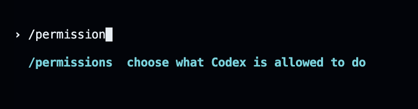
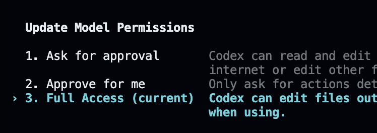
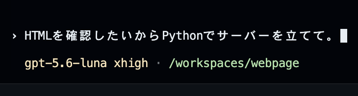
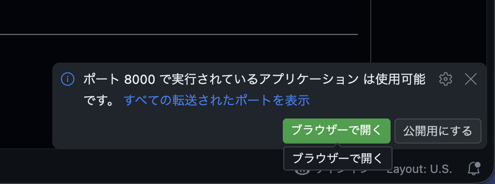

# Codex CLIでWebサイトを作成する

Codex CLIのインストールが完了したら、実際にWebサイトを作っていきましょう。

---

## Codexに依頼する

Codex CLIに対する入力と、ターミナル上で入力するコマンドを区別するため、今後、Codex CLIに対する入力には`user>`を先頭に付けて記述します。

```bash
user> ここにCodexへのメッセージ、プロンプトが入ります。
```

> 注: 上の `user>` は資料上の記法です。実際のCodex CLIには `user>` を付ける必要はありません。

では、早速CodexにHTMLファイルを作ってもらいましょう。

```bash
user> このリポジトリは、GitHub Pagesで公開する自分のWebサイトです。index.htmlを新規作成し、シンプルなHTMLを用意してください。
```


## HTMLページを確認する

作成したHTMLページをブラウザーで確認してみましょう。
今回はコマンドを自分で入力せず、**Codexにサーバーの起動をお願いします。**

### 1. Codexの権限を変更する

GitHub Codespacesでは、通常の権限のままだとサーバーの起動やポート転送がうまくいかないことがあります。
この講義では、先にCodexの権限を変更します。

Codexを起動している画面で、次のコマンドを入力してください。

```text
/permissions
```



上下の矢印キーで `Full Access` に移動し、Enterキーを押します。



> **注意：Full Accessは強い権限です**
>
> Full Accessにすると、Codexが確認なしで多くの操作をできるようになります。便利な反面、意図しない操作につながる可能性もあります。この先、自分で使うときは内容をよく確認し、慎重に選びましょう。

### 2. Codexにサーバーの起動を頼む

続けて、Codexに次のように入力してください。

```bash
user> HTMLを確認したいからPythonでサーバーを立てて。
```



Codexが必要なコマンドを考えて、Pythonの簡易Webサーバーを起動します。
このサーバーは、作成したHTMLをブラウザーに表示するためのものです。

### 3. ブラウザーで開く

サーバーが起動すると、画面の右下にポートの通知が表示されます。



**ブラウザーで開く** をクリックすると、作成したHTMLページが表示されます。
「公開用にする」は押さなくて大丈夫です。

確認が終わったら、Codexに次のように頼んでサーバーを停止します。

```bash
user> Pythonのサーバーを止めて。
```

【トラブルシュート】

* サーバーが起動しない場合は、`Full Access` になっているか確認してから、もう一度Codexに頼む
* 「ブラウザーで開く」が出ない場合は、VS Code（Codespaces）の「ポート」タブから該当ポートを開く
* 画面が更新されない時はファイル保存とブラウザーのリロードを確認

---

## コマンドはCodexに任せる

この講義では、コマンドを覚えて自分で入力するよりも、まずCodexに「何をしたいか」を伝えます。
Codexが実行するコマンドも画面に表示されるので、少しずつ意味を確認していきましょう。

---

# HTMLファイルをGitHubへ送る

作成した `index.html` をGitHubへ送ります。
Gitでは「**変更を記録する**」作業を*コミット*、GitHubへ送る作業を*プッシュ*と呼びます。

本講義では、細かいGitコマンドはCodex CLIに任せます。
Codex CLIのタブに戻り、次のように依頼してください。

```bash
user> 変更を確認してpushしてください
```


Pushにはネットワークアクセスが必要なため、Codexが許可を求めてきています。
`1. Yes, proceed`を選択し、Pushしましょう。


これで、変更の確認、コミット、GitHubへのpushまで完了です。
GitHubでリポジトリのページを開き、`index.html` が表示されていれば成功です。

> **ポイント**
> Codex CLIは *「ユーザーの意図 → 具体的なGitコマンド」* を橋渡ししてくれます。
> 今日の講義では、Git操作は基本的に `変更を確認してpushしてください` と頼めばOKです。

Codexの裏側では、だいたい次の3段階の操作が行われています。

1. **add**: どの変更を記録するか選ぶ
2. **commit**: 変更を記録する
3. **push**: 記録した変更をGitHubへ送る

この3つの名前だけ覚えておくと、あとでGitを学ぶときに理解しやすくなります。

<details markdown="1">
<summary>参考：手動でGit操作を行う場合</summary>

Codexに頼らず自分で行う場合は、通常のターミナルで次の流れを実行します。

```bash
git status
git add .
git commit -m "Add initial site"
git push -u origin main
```

* `git status` は変更内容の確認です。
* `git add .` は現在のフォルダー以下の変更をまとめて記録候補にします。
* `git commit -m "..."` は変更を記録します。
* `git push -u origin main` はGitHubへ送信します。

今すぐ全部覚える必要はありません。今日の作業では、Codex CLIに任せて進めましょう。

</details>

---

## VSCodeのGUIを使ったGit操作

VSCode（GitHub Codespaces上で動いているエディター）は開発のための様々な便利を備えています。
VSCode上のボタンを操作することでも、`git add`, `git commit`, `git push`は簡単にできます。

### Add

左側の虫眼鏡の下にある、丸が繋がっているようなアイコンを押すと、このような表示になります。
もしコードに変更が加えられている場合、`Changes`の下に、変更済みのファイルが一覧で出てきます。

`Changes`の右にある`+`ボタンを押すと、変更があったファイルを全て`add`することができます。


### Commit

Addすると、`Staged Changes`にAddしたファイルが追加されているのが確認できます。
ステージに追加されたファイルをコミットするには、コメント（どんな変更をしたか）が必要なので、
`Changes`の下にある入力欄にコメントを入力します。

入力したら、`✅Commit`を押して、コミット完了です。


### Push

コミットまでできれば、あとは簡単です。
`Sync Changes`を押せば、リモートのGitHubリポジトリに変更を同期できます。


---

前へ → [開発環境の準備](./02-github-codex.md)
次へ → [GitHub Pages へデプロイ](./04-deploy-github-pages.md)
目次へ → [ホーム](./index.md)

---
