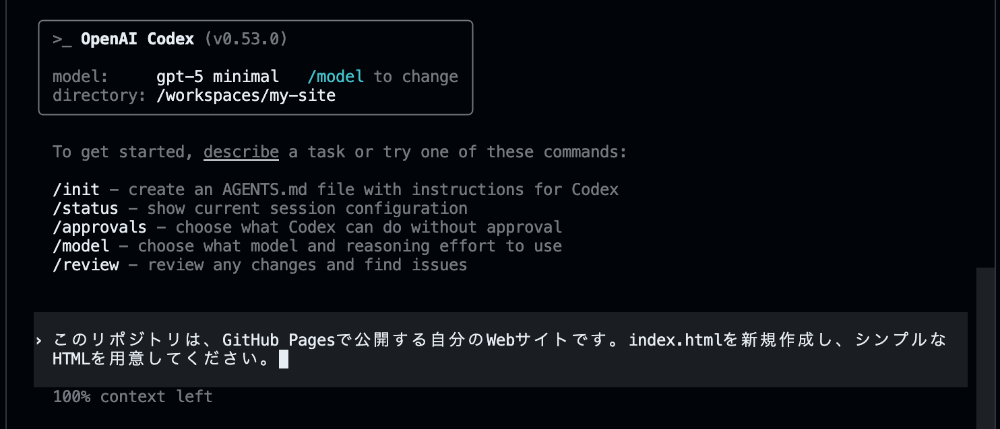
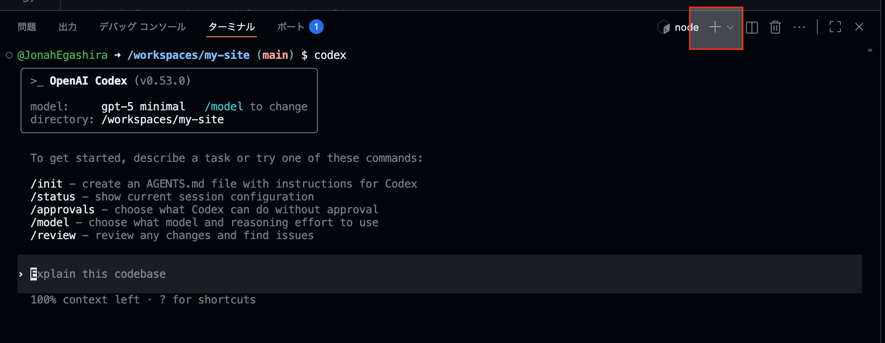
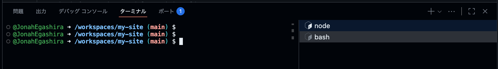
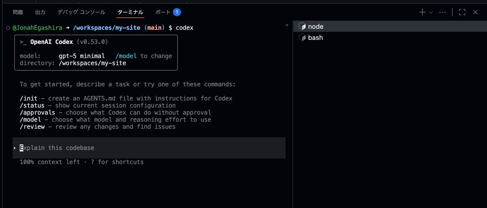
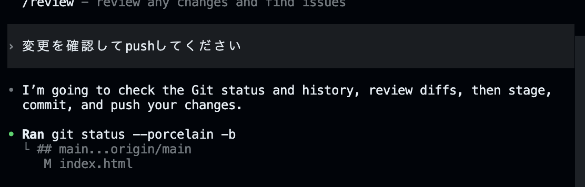
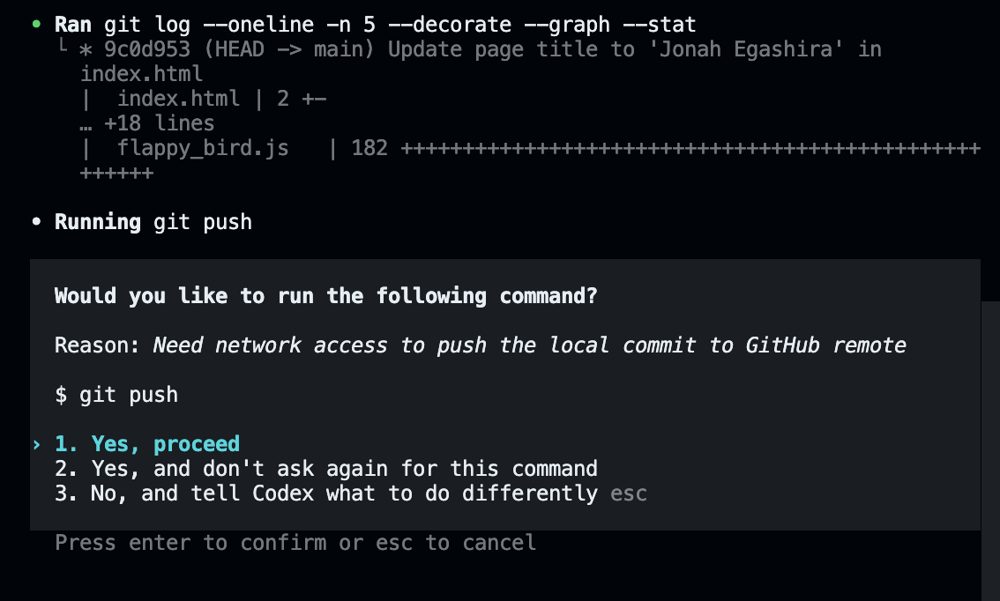

layout: default
title: Codex CLIでサイト作成
----------------------

# Codex CLIでWebサイトを作成する

Codex CLIのインストールが完了したら、実際にWebサイトを作っていきましょう。

---

## Codexに依頼する

Codex CLIに対する入力と、ターミナル上で入力するコマンドを区別するため、今後、Codex CLIに対する入力には`user>`を先頭に付けて記述します。

```bash
user> ここにCodexへのメッセージ、プロンプトが入ります。
```

> 注: 上の `user>` は資料上の記法です。実際のCodex CLIには `user>` を付ける必要はありません。

では、早速CodexにHTMLファイルを作ってもらいましょう。

```bash
user> このリポジトリは、GitHub Pagesで公開する自分のWebサイトです。index.htmlを新規作成し、シンプルなHTMLを用意してください。
```




## HTMLページを確認する

作成したHTMLページの内容を確認してみましょう。
まずはじめに、新しいターミナルの画面を作成します。

ターミナルの右上の「＋」を押します。



bashと表示されて新しい画面になったことを確認します。ここで以下の`python`コマンドを入力します。



ターミナルで以下のコマンドを入力してください。

```bash
python3 -m http.server 5500
```


**ブラウザーで開く** をクリックすると、現状のHTMLファイルが確認できます。
もしくはターミナル上の`http://0.0.0.0:5500/`を、Macであれば⌘+クリック、WindowsであればCtrl+クリックで開くことができます。

このPythonコマンドでは簡易なWebサーバーを立ち上げ、今いるフォルダーの中身をHTTPで配信しています。
停止するには、サーバーを起動しているターミナルで `Ctrl + C` を押してください。

【トラブルシュート】

* 5500番ポートが使用中なら `python3 -m http.server 5501` など別ポートに変更
* 「Open in Browser」が出ない場合は、VS Code（Codespaces）の「PORTS」タブから該当ポートを手動で開く
* 画面が更新されない時はファイル保存とブラウザーのリロードを確認

---

## Codex CLIとターミナルの切り替え

Codex CLIに自然言語で依頼をする場所と、ターミナルでコマンドを入力する場所は異なります。

`npm`や`node`と表示されることがあるタブがCodex CLI（対話用）で、`bash`と書かれているタブが通常のターミナル（コマンド実行用）です。
`user>`と先頭に書かれている文書/指示はCodex CLIに入力し、それ以外のコマンドはターミナル上で入力・実行します。


*Codex CLIが開かれている状態*

---

# HTMLファイルをコミットする

Gitでは「**変更を記録する**」作業を*コミット*と呼びます。
ここでは、Codex CLIが作成した`index.html`をGitHubへアップロードするまでの流れを説明します。

まず、`git`コマンドを入力するために、先ほど作成した**ターミナル**の画面で以下を入力します。


1. **変更内容を確認する**

   ```bash
   git status
   ```

   * 追加・更新されたファイルが赤字で表示されていればOKです。

2. **ステージに追加する**

   ```bash
   git add index.html        # 1つだけ追加
   ```

   または

   ```bash
   git add .                 # 現在のディレクトリ以下をまとめて追加
   ```

   `git status`をもう一度実行すると、追加したファイルが緑色に変わります。これで「コミット候補」になりました。

3. **コミットを作成する**

   ```bash
   git commit -m "Add initial index.html"
   ```

   * `-m`オプションで「何をしたか」を1行で書きます。
   * 後から見返すときに分かりやすいよう、内容を簡潔にまとめましょう。

4. **リモート（GitHub）へ反映（プッシュ）する**

   ```bash
   git push -u origin main
   ```

   * `-u`を付けておくと、次回以降は`git push`だけで済みます。
   * GitHubでリポジトリを開き、`index.html`がアップロードされていれば成功です。
   * pushに失敗する場合は、リモート設定（`git remote -v`）とブランチ名（`main`）を確認してください。

---

### ここまでの流れのおさらい

```bash
git add .
git commit -m "Add initial site"
git push -u origin main
```

> **ポイント**
>
> * *add → commit → push* の3段階を覚えれば、基本操作はほぼカバーできます。
> * こまめなコミットは「戻れるポイント」を増やせるので、失敗しても安心です。

---

## Codex CLIを使ってGit操作を行う

Gitは **バージョン管理において必ず覚えておきたい操作** ですが、
毎回 `git add . → git commit → git push` して、毎回メッセージを書くのは少し面倒ですよね。
そこで、Git操作にもCodex CLIを使ってみましょう。

---

### まずは適当なファイルの変更をする

Codespacesの左側のファイルエクスプローラーを開き、先ほど作成されたHTMLファイルをクリックして開きます。


おそらく `<title></title>` で囲われた部分があると思います。

その部分を手動で以下のように変更します（「私のWebページ」の部分は他の内容でも構いません）。

```html
<title>私のWebページ</title>
```

これで変更は完了です。次に、Codex CLIで変更をGitで管理しましょう。

---

### 1行でpushまでを丸投げ

次のように依頼をすると、今回のファイル変更を一連の流れで `git add`, `git commit`, `git push` まで行うことができます。

```bash
user> 変更を確認してpushしてください
```



Pushにはネットワークアクセスが必要なため、Codexが許可を求めてきています。
`1. Yes, proceed`を選択し、Pushしましょう。



これでadd, commit, pushまで完了です。

> **ポイント**
> Codex CLIは *「ユーザーの意図 → 具体的なGitコマンド」* を橋渡ししてくれます。
> **コマンドの暗記やタイプミスに悩まされず、作業スピードも向上します**（ただし、最低限 add・commit・push は覚えておきましょう）

これで Git の日常的なルーチン作業はほぼ Codex CLI に任せられます。
浮いた時間と集中力を **コンテンツ制作やデザイン改善** に充てましょう。

---

前へ → [開発環境の準備](./02-environment.md)
次へ → [GitHub Pages へデプロイ](./04-deploy-github-pages.md)
目次へ → [ホーム](./index.md)

---
