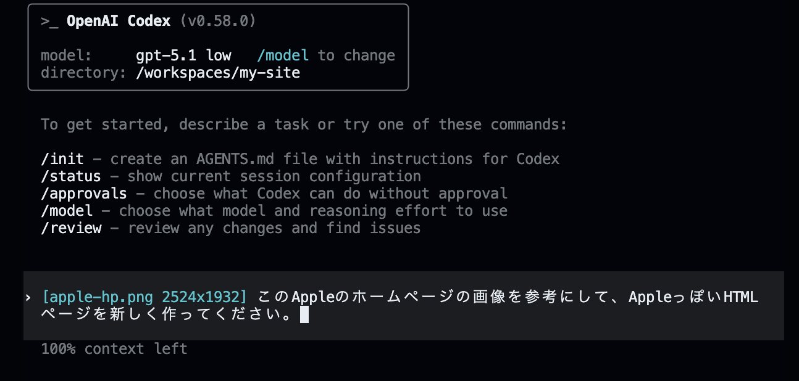

# Codex CLI Tips

Codex CLIは複数の機能を実行できるAIエージェントなので、Webサイトを構築する以外にも、数多くのことができます。詳細は[公式ドキュメント](https://platform.openai.com/docs/)をご覧ください。ここでは便利な機能をいくつか紹介します。

## Web検索

Codex CLIは、Web検索機能を通じてインターネット上の情報を取得し、要約やファイル生成まで行えます。

```bash
user> 直近1週間のAppleの株価を検索して、推移を新しいHTMLファイルに載せてください。 
```


## ファイル（画像）添付

Codex CLIに画像を含むファイルを読み込ませて、そのファイルの内容を解析してもらったり、参考画像をもとにWebページのデザインを行うこともできます。

画像を添付するには、Codex CLIの入力エリアに`@ファイルへのパス`を入力します。まずはCodespacesのファイルエクスプローラーに画像をアップロードしましょう（ドラッグ＆ドロップ、またはエクスプローラーの「Upload」から追加できます）。

パス（path）とは、コンピューター上でファイルやフォルダーがどこにあるかを示す「住所」のようなものです。

ここではAppleのWebページのスクリーンショットを撮り、その画像をCodex CLIに渡して再現してみます。

<details>
<summary>💡 パス（path）を理解しよう</summary>

> **パス = ファイルやフォルダーまでの"道順"**
> パソコンの中で目的地を示す住所のようなものです。

- 絶対パスと相対パス

| 種類       | いつ使う？                           | 例（macOS/Linux）                                   | 例（Windows）                                         |
| -------- | ------------------------------- | ------------------------------------------------ | -------------------------------------------------- |
| **絶対パス** | ファイルの場所を"地球規模"で一意に示したいとき        | `/Users/jonah/projects/my-site/images/apple-hp.png` | `C:\\Users\\jonah\\projects\\my-site\\images\\apple-hp.png` |
| **相対パス** | 今いるフォルダー（カレントディレクトリ）からの距離で示したいとき | `./images/apple-hp.png`                             | `.\\images\\apple-hp.png`                             |

* `./` は "今いる場所"
* `../` は "ひとつ上の階層"

</details>

---

Appleのページのスクリーンショットを撮り、`apple-hp.png`などの名前でCodespacesのファイルエクスプローラーエリアに追加します。


Codex CLIに`@`と入力すると、添付するファイルの候補が出てくるので、`@apple-hp.png`を選択します。その状態で、この画像に対して行いたいリクエストを入力します。

```bash
user> @apple-hp.png このAppleのホームページの画像を参考にして、AppleっぽいHTMLページを新しく作ってください。
```



すると、画像を読み込んだCodex CLIがAppleのページに近いデザインを作成してくれます。iPhoneの画像などは準備していないので表示していませんが、ボタンやヘッダーの見た目はかなり近いのではないでしょうか。


---

## Codex CLIコマンド

Codex CLIとの対話画面で`/`から始まるコマンドを入力することで便利な機能を利用できます。
ここではその中からいくつかを紹介します。

## `/init`

`/init` は、既存のプロジェクトでCodex CLIを導入する際の初期設定コマンドです。

このコマンドを実行すると、`AGENTS.md`というファイルが作成され、プロジェクトの仕様や構造に関する情報が記録されます。以降のCodex CLIとの対話では、この`AGENTS.md`を参照してプロジェクトの文脈を理解した上で実装や修正を行ってくれます。

注意:
- 大きなリポジトリでは `/init` に時間がかかることがあります。
- モデルに読み込ませたくないファイル（秘密情報など）は、実行前に一時的に除外・退避してください。
- 画像や添付ファイルの内容はLLM提供元に送信され得ます。プライバシーや機密情報の取り扱いにご注意ください。

## `/status`

現在のセッションの設定や状態を確認できるコマンドです。使用中のモデルや設定を確認したい場合に便利です。

## `/approvals`

Codexが承認なしで実行できるアクションを設定できるコマンドです。頻繁に行う操作を自動化したい場合に使用します。

## `/model`

使用するモデルや推論の詳細度を選択できるコマンドです。タスクの複雑さに応じてモデルを切り替えることができます。

## `/review`

変更内容をレビューし、問題点を発見するためのコマンドです。コードの品質を確認したい場合に便利です。

## `/compact`

会話が長くなってコンテキストの上限に達しそうな場合に、会話を要約して圧縮するコマンドです。これにより、過去の文脈を保持しながら会話を続けることができます。

ChatGPTやClaudeなどの大規模言語モデル（LLM）は、会話が長くなるほど過去の文脈を保持するコストが増え、性能が下がることがあります。`/compact`を使うことで「今までの会話を一度きれいにまとめ直して、そこから続けられる」ようになります。

## `/clear`

それまでの文脈とは全く異なる新しい機能や変更を行う場合、以前の会話履歴を消去し、一から新たな会話を始める`/clear`コマンドが便利です。

会話が長くなってきたときに、以前の会話の内容を引き継いで実装を続けたい場合には`/compact`を、全く新しい内容を始めたいときは`/clear`を使うとよいでしょう。

---

前へ → [CSS/JavaScriptで拡張](./05-style-and-js.md)
次へ → [おわりに](./07-outro.md)
目次へ → [ホーム](./index.md)

---
