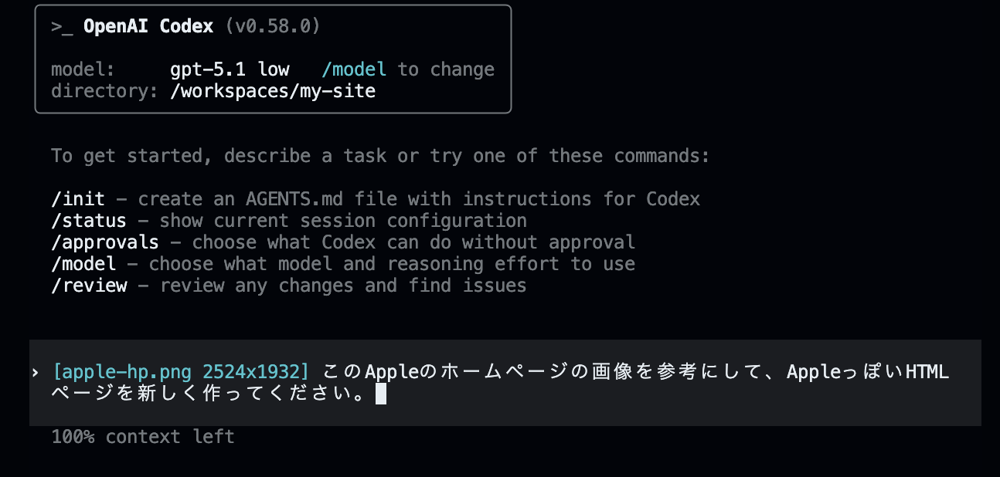

# Codex CLI Tips

Codex CLIは複数の機能を実行できるAIエージェントなので、Webサイトを構築する以外にも、数多くのことができます。詳細は[Codex CLI公式ドキュメント](https://developers.openai.com/codex/cli)をご覧ください。ここでは便利な機能をいくつか紹介します。

## Web検索

Codex CLIは、必要に応じてWeb検索を使い、インターネット上の情報を取得しながら作業できます。ニュース、価格、株価、仕様、公式ドキュメントなど、変わりやすい情報を扱うときに便利です。

```bash
user> Web検索を使って、直近1週間のAppleの株価を調べ、推移を新しいHTMLファイルに載せてください。
```


## ファイル（画像）添付

Codex CLIに画像を含むファイルを読み込ませて、そのファイルの内容を解析してもらったり、参考画像をもとにWebページのデザインを行うこともできます。

画像を添付するには、まずCodespacesのファイルエクスプローラーに画像をアップロードします（ドラッグ＆ドロップ、またはエクスプローラーの「Upload」から追加できます）。その後、Codex CLIの入力エリアで`@`を入力するとファイル候補が表示されるので、添付したい画像を選びます。

パス（path）とは、コンピューター上でファイルやフォルダーがどこにあるかを示す「住所」のようなものです。

ここではAppleのWebページのスクリーンショットを撮り、その画像をCodex CLIに渡して再現してみます。

<details>
<summary>💡 パス（path）を理解しよう</summary>

> **パス = ファイルやフォルダーまでの"道順"**
> パソコンの中で目的地を示す住所のようなものです。

- 絶対パスと相対パス

| 種類       | いつ使う？                           | 例（macOS/Linux）                                   | 例（Windows）                                         |
| -------- | ------------------------------- | ------------------------------------------------ | -------------------------------------------------- |
| **絶対パス** | ファイルの場所を"地球規模"で一意に示したいとき        | `/Users/jonah/projects/my-site/images/apple-hp.png` | `C:\\Users\\jonah\\projects\\my-site\\images\\apple-hp.png` |
| **相対パス** | 今いるフォルダー（カレントディレクトリ）からの距離で示したいとき | `./images/apple-hp.png`                             | `.\\images\\apple-hp.png`                             |

* `./` は "今いる場所"
* `../` は "ひとつ上の階層"

</details>

---

Appleのページのスクリーンショットを撮り、`apple-hp.png`などの名前でCodespacesのファイルエクスプローラーエリアに追加します。


Codex CLIに`@`と入力すると、添付するファイルの候補が出てくるので、`@apple-hp.png`を選択します。その状態で、この画像に対して行いたいリクエストを入力します。

```bash
user> @apple-hp.png このAppleのホームページの画像を参考にして、AppleっぽいHTMLページを新しく作ってください。
```



すると、画像を読み込んだCodex CLIがAppleのページに近いデザインを作成してくれます。iPhoneの画像などは準備していないので表示していませんが、ボタンやヘッダーの見た目はかなり近いのではないでしょうか。


---

## Codex CLIコマンド

Codex CLIとの対話画面で`/`から始まるコマンドを入力することで便利な機能を利用できます。

| コマンド | 目的 | 使用タイミング |
|---------|------|--------------|
| `/model` | 使用モデルの選択（推論レベルも設定可能） | タスクの複雑さに応じてモデルを切り替えたいとき |
| `/permissions` | Codexが承認なしで実行できる範囲を設定 | 承認要件を緩めたり厳しくしたいとき |
| `/review` | 作業ツリーのレビューを依頼 | Codexの作業完了後や、ローカル変更を確認したいとき |
| `/plan` | 実装前に計画を立ててもらう | いきなり編集せず、方針を先に確認したいとき |
| `/new` | 同じCLIセッション内で新しい会話を開始 | 文脈をリセットして新しいタスクを始めたいとき |
| `/clear` | 画面をクリアして新しい会話を開始 | 画面を整理して区切り直したいとき |
| `/init` | 現在のディレクトリに`AGENTS.md`を生成 | リポジトリに永続的な指示を記録したいとき |
| `/compact` | 会話を要約してトークンを節約 | 長い会話の後、文脈を保持しつつ継続したいとき |
| `/copy` | 直近のCodex出力をコピー | 返答や計画を別の場所に貼り付けたいとき |
| `/diff` | git diff（未追跡ファイル含む）を表示 | コミットやテスト前にCodexの編集を確認したいとき |
| `/mention` | ファイルを会話に添付 | Codexに特定のファイルやフォルダを読み込ませたいとき |
| `/status` | セッション設定とトークン使用量を表示 | 現在のモデル、承認ポリシー、残りコンテキストを確認したいとき |
| `/mcp` | 設定済みのMCPツールを一覧表示 | Codexが呼び出せる外部ツールを確認したいとき |
| `/logout` | Codexからサインアウト | 共有マシンで認証情報をクリアしたいとき |
| `/quit` `/exit` | CLIを終了 | セッションを終了するとき |
| `/feedback` | Codex開発チームにログを送信 | 問題報告や診断情報を共有したいとき |

### 補足

- **`/permissions`の注意点**: `Full Access`のような強い権限は、Codexがネットワークアクセスや広いファイル操作をしやすくなるため、信頼できるリポジトリと作業内容のときだけ使いましょう。
- **`/compact`と`/new`の使い分け**: 会話が長くなったとき、以前の内容を引き継ぎたい場合は`/compact`を、全く新しい内容を始めたいときは`/new`を使いましょう。
- **`/init`の注意点**: 大きなリポジトリでは時間がかかることがあります。秘密情報を含むファイルは実行前に除外してください。

---

前へ → [CSS/JavaScriptで拡張](./05-style-and-js.md)
次へ → [おわりに](./07-outro.md)
目次へ → [ホーム](./index.md)

---
