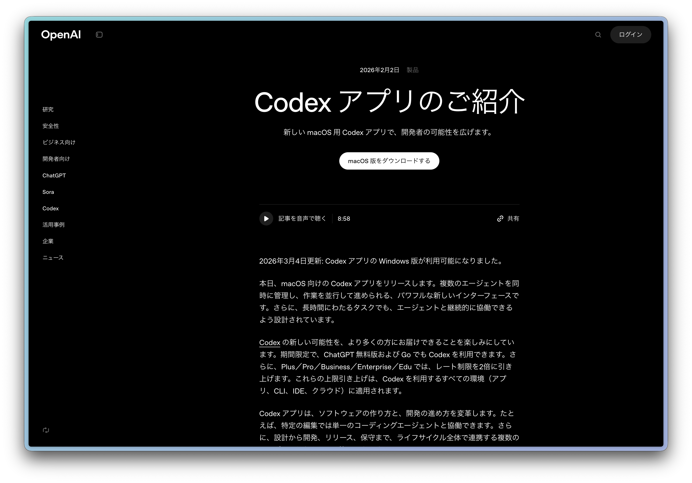
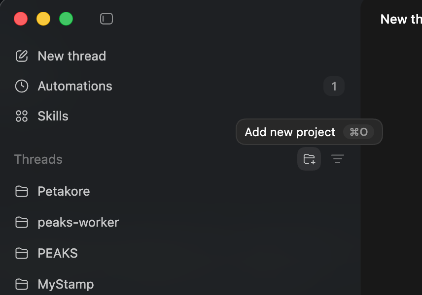
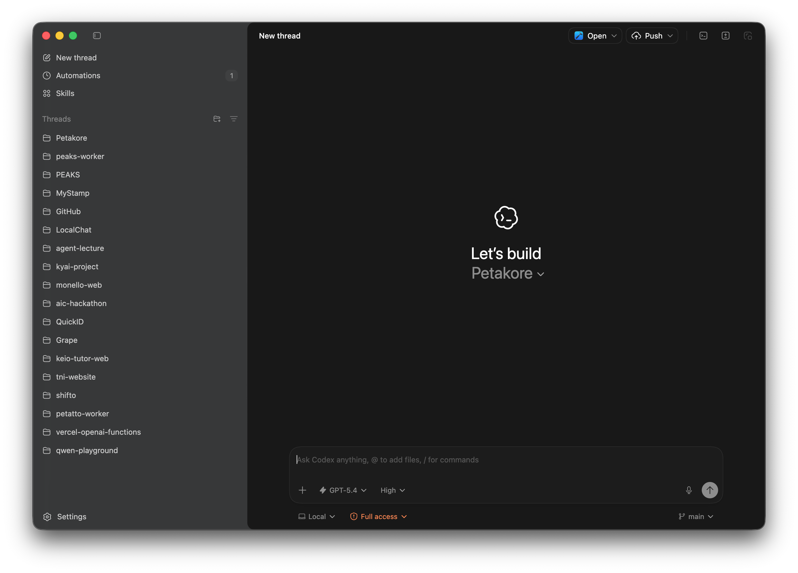
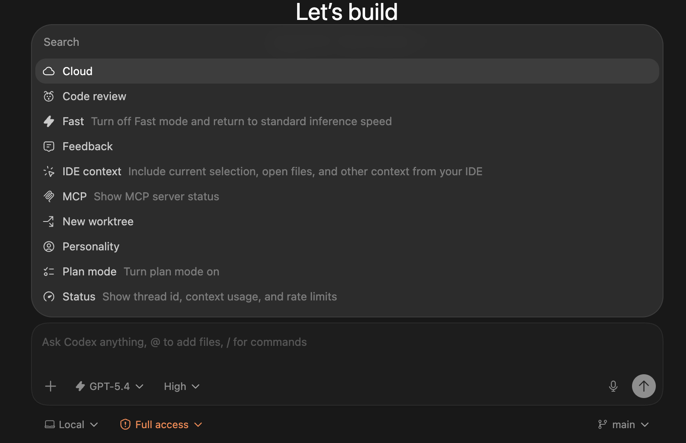
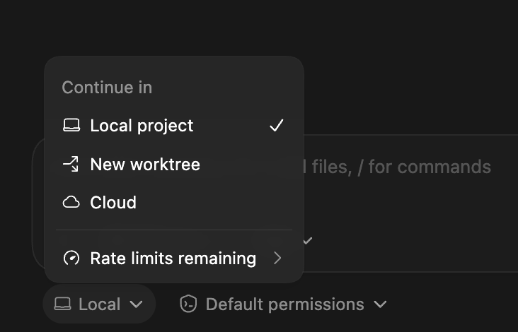
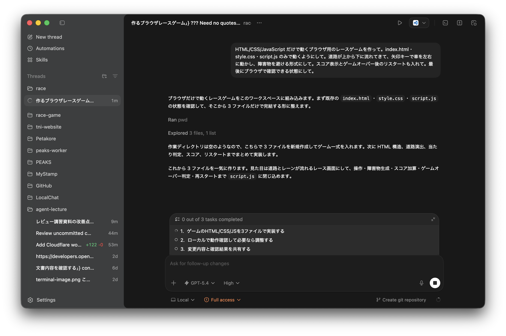
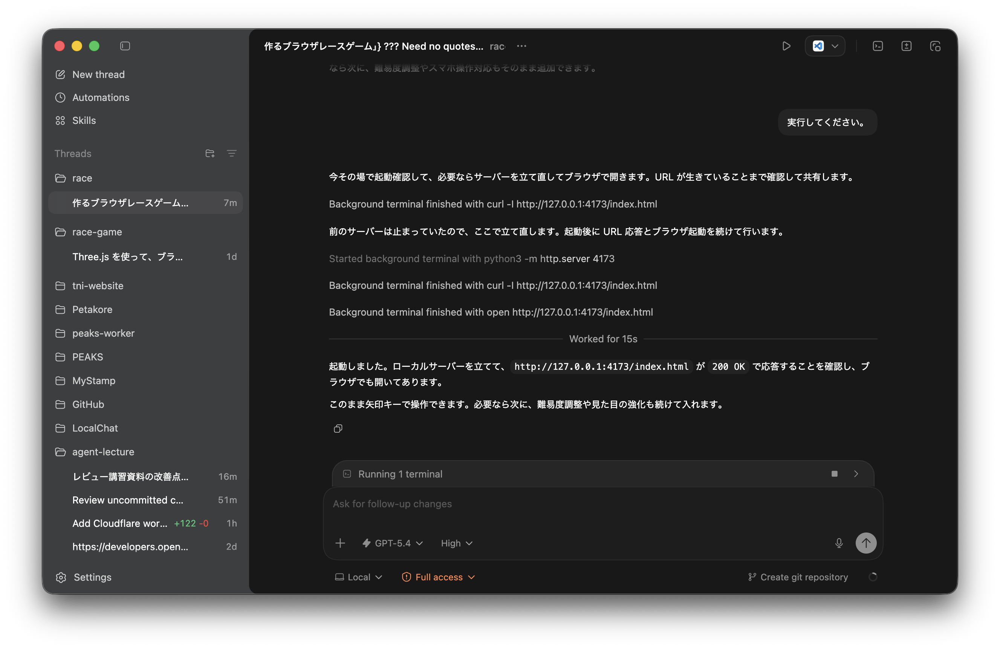
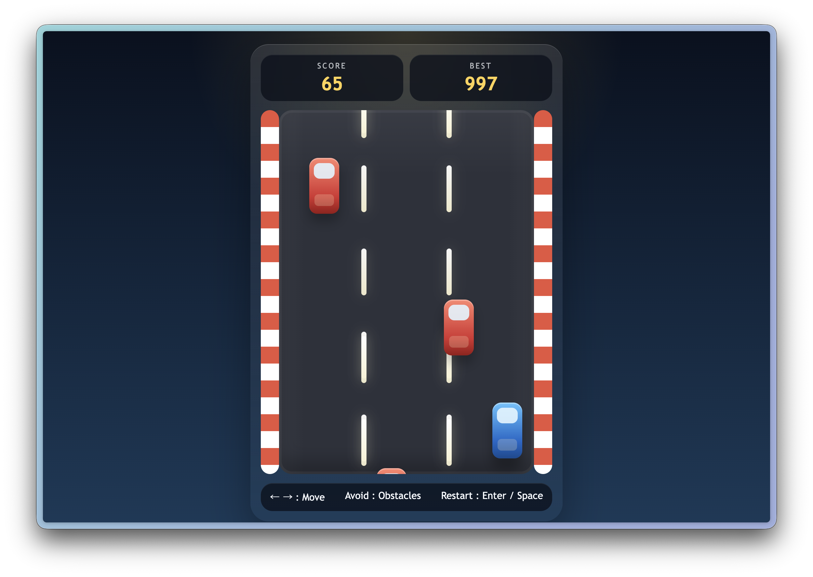
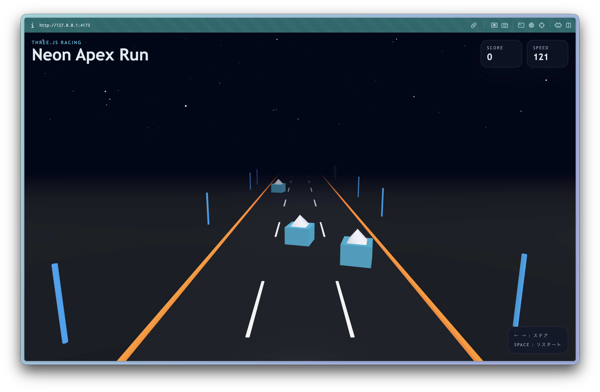

# Codex Appを使ってみる

ここまでは、GitHub Codespaces上でCodex CLIを使ってWebサイトを作ってきました。
この章は本編の必須手順ではなく、**同じような開発をCodex Appで行う場合の紹介**です。

Codex Appは、自分のPCにインストールして使うOpenAIのデスクトップアプリです。
Codespacesを使わず、自分のPC上のフォルダーを直接開いて、Codexにファイル作成・編集・コマンド実行を任せられます。

## Codex CLIとの違い

Codex CLIとCodex Appは、どちらもOpenAIのコーディングエージェントです。
大きな違いは、使う場所と画面の見え方です。

| 項目 | Codex CLI | Codex App |
|---|---|---|
| 使う場所 | ターミナル、Codespaces、ローカルPC | macOS / Windows のデスクトップアプリ |
| 操作方法 | 文字ベースで指示する | アプリ画面でプロジェクトやスレッドを選びながら指示する |
| 向いている場面 | Codespaces上で手軽に始める、ターミナル操作に慣れる | 自分のPCのフォルダーで継続的に開発する |
| 変更確認 | ターミナルやエディターで確認 | アプリ内の差分表示やGit機能で確認しやすい |

この講習の本編はCodespacesとCodex CLIで完結します。
Codex Appは、今後も自分のPCで開発を続けたい人向けの選択肢として捉えてください。
Appを使うと、作業フォルダーや変更内容を画面上で確認しやすくなります。

> 公式ドキュメントでは、Codex AppはmacOSとWindows向けに提供されています。この講習では、Codex Appを細かくセットアップする時間は取らないので、使ってみたい人向けの紹介として読んでください。

## Codex Appって何？

Codex Appは、OpenAIが提供する **AIコーディングエージェント** のデスクトップアプリです。
日本語で「こんなものを作りたい」と伝えるだけで、AIが実際にコードを書いてくれます。

**何ができるの？**

- プログラムのファイルを新しく作ったり、既存のファイルを編集したりしてくれる
- 複数のファイルにまたがる変更も一度にやってくれる
- コマンドを実行して、プログラムが正しく動くか確認してくれる
- 「ここが動かない」と伝えるだけで、原因を調べて修正してくれる

プログラミングの知識が少なくても使い始められますが、「何を作りたいか」を言葉で伝える力が大事です。

## ChatGPTとの違い

ChatGPTは、ブラウザーやアプリで使うAIツールです。
対話しながら情報を得たり、文章や画像を作ったりできます。

Codex Appは、より開発作業に寄ったツールです。
ローカルのフォルダーを開き、その中のファイルを作成・編集し、必要に応じてコマンドを実行できます。
つまり、会話するだけでなく、**実際の開発作業まで進められるAI** です。

---

## Codex Appで使う場合の初期セットアップ

自分のPCにCodex Appを入れて作業する場合は、以下のように準備します。
講義中に全員で実施する手順ではないので、興味がある人向けの参考として読んでください。

Windows版・macOS版の両方が提供されています。
以下の公式ページからダウンロードできます。

- [Codex App公式ドキュメント](https://developers.openai.com/codex/app/)
- [Codex Quickstart](https://developers.openai.com/codex/quickstart/)



### 0. 事前に必要なもの

- インターネットに接続できる環境
- 自分のPC（WindowsまたはmacOS）
- ChatGPTアカウント

### 1. Codex Appをダウンロードする

1. ブラウザーで [Codex App公式ドキュメント](https://developers.openai.com/codex/app/) を開きます。
2. 自分のPCのOS（WindowsまたはmacOS）に合ったものを選んでダウンロードします。
3. macOSでIntel Macを使っている場合は、Intel向けのビルドを選びます。
4. ダウンロードが終わったら、ダウンロードしたファイル（インストーラー）を開きます。

### 2. Codex Appをインストールして起動する

1. インストーラーの案内に従ってインストールします。
2. インストールが終わったらCodex Appを起動します。
3. 初回画面が開いたら、そのまま次へ進みます。

### 3. Codexにログインする

ChatGPTアカウントでサインインしてください。
使えるモデルや利用枠は、契約プランやその時点の提供状況によって変わることがあります。
講義中にCodex Appを使わない場合は、この手順は読み物として眺めるだけで大丈夫です。

### 4. 作業フォルダーを作る

Codex Appでゼロから何かを作る場合は、まず空のフォルダーを作ります。

1. デスクトップなど、見つけやすい場所に新しいフォルダーを作ります。
2. フォルダー名は自由でOKです。例: `codex-handson`

> **なぜフォルダーを用意するの？**
> Codex Appは、開いたフォルダーの中にファイルを作成・編集します。
> 専用のフォルダーを作っておかないと、デスクトップや他のフォルダーにファイルが散らばってしまいます。

### 5. 作ったフォルダーをCodex Appで開く

1. Codex Appの画面で「プロジェクトを追加」（または「Open Project」）を選びます。
2. さきほど作った `codex-handson` フォルダーを選択して開きます。
3. 画面の上部にフォルダー名が表示されていれば、正しく開けています。



### 6. Codex Appの画面



- **左側**: スレッド（会話の履歴）やプロジェクトを切り替えるサイドバー
- **中央**: Codexとやり取りするメイン画面。AIの回答やコードの変更内容がここに表示されます
- **下の入力欄**: AIへの指示を書いて送る場所。入力欄で **`/`（スラッシュ）** を打つと、レビューやプラン作成などのコマンド一覧が表示されます
- **入力欄の下**: 使用するモデルや権限設定などを切り替えるボタンがあります



## Codex Appの実行場所



Codex Appでは、スレッドを始めるときに実行場所を選べます。

- `Local`: 自分のPC上のフォルダーで直接作業する
- `Worktree`: Gitのworktreeを使って、今の作業とは別の場所で安全に並行作業する
- `Cloud`: OpenAIのクラウド環境で実行する

Webサイト制作のような小さな練習では、まず `Local` を選べば十分です。

---

## Codex Appで同じように作るなら

Codex Appで何か作ってみる場合は、下の入力欄に指示を書いて送ります。
たとえば、CLIでWebサイトを作ったのと同じように、ゲーム制作を頼むこともできます。

```text
HTML/CSS/JavaScript だけで動くブラウザ用のレースゲームを作って。
index.html・style.css・script.js のみで動くようにして。
道路が上から下に流れてきて、矢印キーで車を左右に動かし、
障害物を避ける形式にして。
スコア表示とゲームオーバー後のリスタートも入れて。
最後にブラウザで確認できる状態にして。
```

もちろん、自分が作ってみたいWebページやミニアプリを自由に指示してもOKです。

## Codexの動作を見る

メッセージを送ると、Codexがやることを自動でリストアップして、順番に実行していきます。



コードの生成が終わると、Codexが必要に応じてファイルを作成し、ブラウザーで確認するための手順まで案内してくれます。
完了すると、ブラウザーで確認するためのURLや開き方が表示されることがあります。



---

## Appで作ったものを動かす

CodexがURLや開き方を案内したら、その手順に沿ってブラウザーで確認してみましょう。
HTMLファイルを直接開くだけでよいこともあれば、ローカルサーバーを起動して表示することもあります。



URLが表示されなかった場合や、自分でコマンドを実行したい場合は、Codex Appに内蔵されているターミナルを使えます。

**Codexに頼む（一番簡単）**

「このプログラムを動かして」と指示すれば、Codexが実行まで代わりにやってくれます。
動かし方がわからないときも、「どうやって動かせばいい？」と聞けば教えてくれます。

**自分で実行する: 組み込みターミナルを使う**

- 画面右上のターミナルアイコンをクリック
- または **Cmd+J**（macOS）/ **Ctrl+J**（Windows）

ターミナルが画面下部に表示され、プロジェクトのフォルダーでそのままコマンドを実行できます。

<details markdown="1"><summary>💡 ターミナルって何？</summary>

ターミナル（コマンドライン）は、キーボードで文字を打ってPCに命令を送る画面のことです。
マウスでアイコンをダブルクリックする代わりに、コマンドと呼ばれる短い命令文を入力します。
プログラムの起動、ファイルの操作、サーバーの立ち上げなど、開発作業の多くはここで行われます。

</details>

---

## Appでさらに発展させる

ゲームが動いたら、続けて指示を出して改造してみましょう。
たとえば、次のように頼めます。

- `スコアが上がるとスピードが上がるようにして`
- `障害物の種類を増やして、ランダムに出てくるようにして`
- `BGMや効果音をつけて`
- `スマホでも遊べるように、タッチ操作に対応して`
- `Three.jsを使って3Dにして`



---

## Appで作る場合もGitで管理する

Codex Appでファイルを作成・編集する場合も、作業の区切りごとにGitで記録しておくと安心です。
AIが変更した部分をあとから確認したり、失敗したときに前の状態へ戻したりできます。

また、Codex Appの `Worktree` モードなど、Gitを使っていると便利になる機能もあります。

**Codexに頼む**

```text
このプロジェクトを Git で管理して。最初のコミットまでやって。
```

これだけで、CodexがGitの初期設定から最初の記録（コミット）までやってくれます。

**自分でやる場合**

組み込みターミナルを開いて、以下の3つのコマンドを順番に実行します。

```bash
git init
git add .
git commit -m "first commit"
```

| コマンド | やっていること |
|---|---|
| `git init` | このフォルダーをGitで管理し始める（最初に1回だけ実行） |
| `git add .` | フォルダー内のすべてのファイルを「次に記録する対象」として選ぶ |
| `git commit -m "..."` | 選んだファイルの現在の状態を、メッセージ付きで記録する |

今すぐ全部覚えなくても大丈夫です。
今後も開発を続けたい人は、この3つのコマンドだけでも覚えておくと便利です。

## 公式ドキュメント

- [Codex App](https://developers.openai.com/codex/app/)
- [Codex App Features](https://developers.openai.com/codex/app/features/)
- [Codex CLI Command Line Options](https://developers.openai.com/codex/cli/reference/)

---

前へ → [Codex CLI Tips](./06-tips-and-tricks.md)
次へ → [エージェント Tips](./08-agent-tips.md)
目次へ → [ホーム](./index.md)

---
