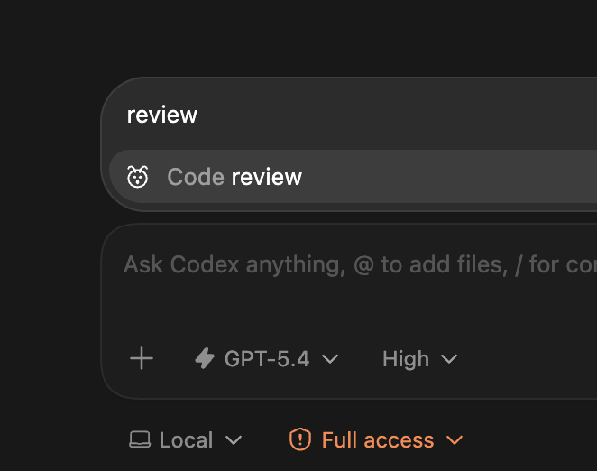
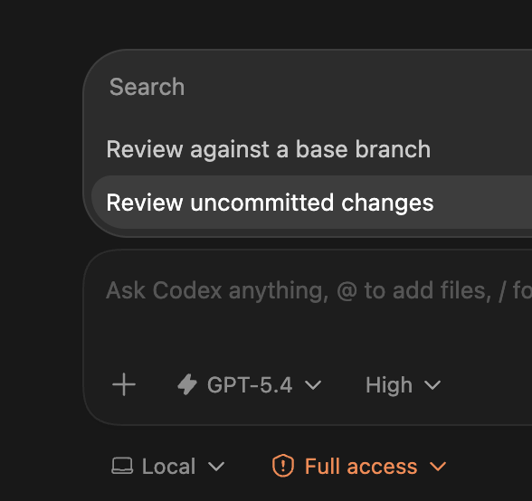

# エージェント Tips

> **はじめに**
>
> 初学者や開発に慣れ親しんでいない方には、「これはどういうことだ、訳がわからない」と感じる部分もあるかと思います。本講座は初学者〜経験者を幅広く対象にしているため、そういった箇所があることをあらかじめご了承ください。
>
> ただ、これからの時代は、AI でも何でも使って自分の作りたいものをまず作ってみて、その後に「どういう仕組みで動いているのか」「周辺の基礎知識は何か」を学んでいく、リバースエンジニアリング的な学習がますます重要になってきます。今はわからないところがあっても、将来「ああ、こんなことあったな」と思い出して、自己学習のきっかけや Tips として活用していただければうれしいです。

### 1. プロンプトを過信しない

プロンプト（AI への指示文）だけで、コードの品質や正確性を保証することはできません。
どんなに上手く指示を書いても、AI が間違ったコードを出力する可能性は常にあります。

大事なのは、**出力されたコードを仕組みで検証すること**です。具体的には、テストの実行、lint（コードの問題を自動検出するツール）によるチェック、人間によるレビューなどが挙げられます。

「うまく指示を書けば大丈夫」ではなく、「間違っていたら気づける仕組み」を整えましょう。

### 2. 強いガードレールを敷く

ガードレールとは、AI が間違ったコードを書いたときに**自動的に気づける仕組み**のことです。以下のような対策を組み合わせましょう。

- **型付け言語を使う** — TypeScript / Go / Rust / Kotlin / Swift など、型（データの種類）をチェックしてくれる言語を選ぶと、AI のミスを機械的に検出できます
- **lint / formatter を整える** — lint はコードの問題を自動検出するツール、formatter はコードの書き方（インデントや改行など）を自動で統一するツールです
- **テストを用意する** — テストとは、「このコードが正しく動くか」を自動で確認するプログラムのことです。例えば「消費税を計算する関数に 1000 を渡したら 1100 が返る」というチェックを書いておけば、AI がその関数を書き換えても、結果がおかしくなった瞬間に気づけます。AI が書いたコードも必ずテストで検証しましょう
- **コード変更のたびに自動チェックを走らせる** — これを CI（Continuous Integration）と呼びます。コードを変更するたびに自動でテストやチェックを実行し、チェックが通らないとコードをマージ（統合）できないようにします
- **すぐ戻せるようにする** — 小さい PR（Pull Request: コード変更の提案単位）で出す / コミットをこまめにしておく / 問題が起きたらすぐ元に戻せる手順を決めておく


> **もっと学びたい人へ**
> - [テスト駆動開発](https://www.amazon.co.jp/%E3%83%86%E3%82%B9%E3%83%88%E9%A7%86%E5%8B%95%E9%96%8B%E7%99%BA-Kent-Beck/dp/4274217884)（Kent Beck 著 / 和田卓人 訳）— TDD の原典。テストを先に書いて設計を駆動する手法を学べます
> - [質とスピード](https://speakerdeck.com/twada/quality-and-speed-2022-spring-edition)（和田卓人 講演スライド）

### 3. AGENTS.md を整備する

`AGENTS.md` は、**AI コーディングエージェント向けの説明書**です。プロジェクトのフォルダの一番上（ルートディレクトリ）に置くと、Codex をはじめ 多くのエージェント（Cursor、GitHub Copilot、Google Jules など）が作業開始時に自動で読み込みます。

イメージとしては、「新しいチームメンバーが初日に読むドキュメント」です。プロジェクトのルールや手順をここに書いておけば、AI もそれに従って作業してくれます。

#### 書くべきこと

| セクション | 内容の例 |
|---|---|
| セットアップ | `npm install` / `pip install -r requirements.txt` など |
| ビルド・実行 | `npm run dev` / `python main.py` など |
| コードスタイル | 使用言語、命名規則、フォーマッタの指定 |
| テスト | テスト実行コマンド、カバレッジ要件 |
| ガードレール | コード変更後に必ず実行すべきコマンド |

#### 記述例

```markdown
# AGENTS.md

## セットアップ
npm install

## コード変更後に必ず実行すること
1. `npm run lint` — lint を通す
2. `npm run typecheck` — 型チェックを通す
3. `npm run test` — テストを通す
4. `npm run build` — ビルドが壊れていないか確認する

上記がすべて通るまで、変更を完了としないでください。

## コードスタイル
- TypeScript で書く
- 変数名・関数名は camelCase
- コンポーネントは PascalCase
```

ポイントは、エージェントに「やるべきこと」と「やってはいけないこと」を明確に伝えることです。これにより、Tip 2 で挙げたガードレールをエージェントが自動的に守るようになります。

#### 階層構造

モノレポ（複数のプロジェクトを1つのリポジトリで管理する構成）など大きなプロジェクトでは、フォルダごとに `AGENTS.md` を置けます。エージェントはルートから作業フォルダまで順にすべて読み込み、より近いフォルダにある `AGENTS.md` の指示が優先されます。

> **もっと学びたい人へ**
> - [Custom instructions with AGENTS.md](https://developers.openai.com/codex/guides/agents-md/)（OpenAI 公式ドキュメント）— 配置ルールや設定方法の詳細
> - [AGENTS.md](https://agents.md/)（Agentic AI Foundation / Linux Foundation）— 仕様の公式サイト。対応エージェント一覧も確認できます

### 4. エージェントにレビューさせる

Codex の入力欄で `/` を打つと使えるコマンドの中に、`/review`（コードレビュー）があります。



AI が書いたコードを同じ AI にレビュー（問題がないかチェック）させるのは一見無意味に思えるかもしれませんが、設計上の問題をかなり見つけてくれます。

人間も自分の文章を後から読み返すと間違いに気づくのと同じことです。「書くモード」と「チェックするモード」を分けることで、精度が上がります。

#### /review の 2 つのモード

`/review` を選ぶと、次の 2 つからレビュー対象を選べます。



- **Review against a base branch** — 現在のブランチ（作業中の枝）と、元のブランチ（main など）を比較してレビューします。PR を出す前のチェックに便利です
- **Review uncommitted changes** — まだコミット（記録）していない変更だけをレビューします。作業途中にサッと確認したいときに使います

特に重要な部分（お金の計算や個人情報の処理など）では、AI レビューが通り、自分でもコードの意味を理解できるまで変更を取り込まない、くらいの慎重さがちょうどいいです。

#### なぜ AI レビューが必須なのか

AI の性能向上でコードの出力量が爆発的に増え、1日数万行以上のコードが生成されることも珍しくありません。この量を人間だけでレビューするのは現実的ではないため、**AI によるレビューを標準の作業フローに組み込む**ことが強く推奨されます。

もちろん、AI のレビュー結果をすべて鵜呑みにしてよいわけではありません。最終的に問題が起きたときに責任を取るのは、実装した人・承認した人です。どこまでの裁量をAIに持たせ、どこまで人間が関与し確認するかは、プロジェクトやチームの運営方針によって大きく異なる、難しい問題と言えるでしょう。

> **もっと学びたい人へ**
> - [Codex app の機能一覧](https://developers.openai.com/codex/app/features/)（OpenAI 公式ドキュメント）— `/review` を含む Codex app の機能について確認できます

### 5. ドキュメントにまとめる

似たような機能を複数作成する時や、変更の意図・履歴を残したいときには、「こういう機能を作って」「このバグを直して」といった指示を毎回チャットで一から書くのではなく、`.md`（Markdown）ファイルに書いてまとめておき、エージェントに読み込ませましょう。

運用例:

```
/docs     … プロジェクトの概要・目的・設計方針などをまとめたドキュメント
/issues   … 作りたい機能や見つかったバグを 1件ずつ .md ファイルで管理
  /solved … 完了した issue をここに移動。どう解決したかも記録しておく
```

解決方法を残しておくと、似た問題が再発したときに「この .md を読んで同じように対処して」と指示するだけで済みます。この考え方は、後述の Skills と似ています。

### 6. 並列作業をする

作りたい機能をドキュメントで1つずつ切り出しておけば、複数のエージェントに同時に別々の作業をさせられます。エージェントが実装している間、人間は別の作業ができるので、同時に進める数が多いほど全体の効率が上がります。

ただし、同時に進める数が増えるほど、完成したコードをレビューする負担も増えるため、先述の AIによるレビュー等を仕組みとして整える必要があります。

> **もっと学びたい人へ**
> - [Codex app](https://developers.openai.com/codex/app/)（OpenAI 公式ドキュメント）— スレッドごとに独立した作業環境を持ち、worktree で並列作業を安全に行えます

### 7. 常に最新・最高のモデルを使う

AI にコードを書かせるなら、モデルの性能には妥協しないでください。当たり前ですが、性能が高いモデルほど、正確なコードを生成しやすくなります。また、[推論レベル（reasoning level）も高めに設定する](https://developers.openai.com/cookbook/examples/gpt-5/codex_prompting_guide)のがおすすめです。

これは Codex に限った話ではありません。普段の ChatGPT でも、複雑なタスクを頼むときは **thinking モードをオン**にしてください（絶対に！）。オフのままだと、モデルが「考えずに」回答します。

実際にコーディングエージェントを契約して開発で使う上では、現時点のおすすめは ChatGPT Plus で Codex（GPT-5.4） を利用することです。月額料金に対して出力品質が高く、バランスが良いです。

#### Claude Code 

Codex の他に、Anthropic が提供する **[Claude Code](https://code.claude.com/docs/ja/overview)** も有力な選択肢です。「Codex より意図した成果が出やすい」「説明のわかりやすさが上」と感じている人も多く、どちらが合うかは実際に使ってみないとわかりません。

実際に、この講義資料の文章の校正は Claude Code が担当しています。説明文の読みやすさや言葉の整理に関しては、個人的に Claude の方が一枚上手だと感じています。

Codex か Claude かというのは、 [Vi vs Emacsのエディタ戦争](https://ja.wikipedia.org/wiki/%E3%82%A8%E3%83%87%E3%82%A3%E3%82%BF%E6%88%A6%E4%BA%89) のような話で、現時点では結論は出せません。実際に両方使ってみて、自分に合う方を選んでください。

### 8. 権限設定を理解する

Codex app では、AI にどこまでの操作を許可するかを入力欄の下で切り替えられます。

| モード | 動作 |
|---|---|
| **Default** | プロジェクト内のファイル編集は自動で行いますが、外部コマンドの実行やインターネットへのアクセスが必要なときは「実行していいですか？」と確認を求めます |
| **Full Access** | すべての操作を確認なしで自動実行します |

最初は **Default** のまま使ってください。AI が何をしようとしているか毎回確認できるので、動きを理解しやすいです。

#### Full Access で運用するには

AI モデルの性能が十分に高ければ、Full Access の方が効率は圧倒的に上がります。操作のたびに確認ボタンを押す手間がなくなるからです。

私自身は GPT-5.4 を信頼しているため、Full Access で運用しています。ただし、その代わりに AGENTS.md で「データの削除や本番環境（実際のユーザーが使っている環境）への直接変更は行わないこと」と明記しています。

つまり、**権限を広げる分だけ、AGENTS.md で「やってはいけないこと」を厳しく書いておく**というバランスが大事です。

> **もっと学びたい人へ**
> - [Agent approvals & security](https://developers.openai.com/codex/agent-approvals-security/)（OpenAI 公式ドキュメント）— 権限設定とサンドボックスの詳細

### 9. Web search を ON にする

Codex の モデル（GPT-5.4）は豊富なプログラミング知識を持っていますが、学習データには時期的な限界があります。AI は学習時点までの情報しか知らないため、それ以降にリリースされた新しいフレームワークやライブラリには対応できません。

例えば、GPT-5.4 の knowledge cutoff（学習データの最終時期）は 2025年8月31日ですが、iOS26 のリリースは 2025年9月16日です。つまり、iOS26 の新機能について AI は「知らない」状態です。

Web search を ON にして「公式ドキュメントを調べて実装して」と指示すれば、AI がインターネットで最新情報を検索した上で実装してくれます。

#### Web search の 2 つのモード

Web search には **cached** と **live** の 2 つのモードがあります。

| モード | 仕組み | 向いている場面 |
|---|---|---|
| **cached** | OpenAI が事前に収集・保存した検索結果を使う | 通常の調査。十分な情報が得られることが多い |
| **live** | その場でリアルタイムに Web を検索する | 今日リリースされた機能や最新ニュースなど、直近の情報が必要なとき |

権限設定との関係として、**Default** 権限では cached、**Full Access** では live が使われやすくなります。

### 10. Skills を活用する

Skills は、特定のタスクに必要な**手順・知識・スクリプト（自動実行用のプログラム）を1つのフォルダにまとめたもの**です。エージェントが必要に応じて読み込み、作業の手引きとして使います。

```
skill-folder/
├── SKILL.md       … 手順と説明（必須）
├── scripts/       … 実行スクリプト（任意）
├── references/    … 参考ドキュメント（任意）
└── assets/        … テンプレートなど（任意）
```

Codex app では `/skills` や `$スキル名` で呼び出せます。タスクの内容に応じて自動的に選択されることもあります。

#### Skills の作成・利用について

Skill は **専門的な知識を持った人間が作る、または信頼できる公式のものを使うのが推奨** です

AI に Skills を作らせるのは基本的に意味が薄いです。Skills の目的は「AI がまだ知らない手順や、プロジェクト固有のやり方」を教えることです。AI 自身に作らせると、すでに知っている知識を書き出すだけになります。

良い Skills 活用の例:

- **確定申告の自動化** — 税務の専門知識を持つエンジニアが作った OSS の Skill「[shinkoku](https://zenn.dev/kazukinagata/articles/83fe82191db01b)」。領収書のスキャンから e-Tax 提出までを自動化します。ドメイン知識があればこういった Skill も作れます（ただし、このような Skill の正確さについては実際に検証が必要です）
- 自社のデプロイ手順（AI が知りようがない社内フロー）
- 特定の API の使い方（公式ドキュメントから抜粋した正確な手順）
- チーム固有のコーディング規約やレビュー基準

OpenAI が公式に提供している [Skills カタログ](https://github.com/openai/skills) もあります。`$skill-installer` で curated（検証済み）や experimental（実験的）なスキルをインストールできます。

#### 注意: 悪意のある Skills

Skills の本体は `SKILL.md` というテキストファイルです。エージェントはこれを「手順書」として読み込み、書かれた通りに動こうとします。**SKILL.md に悪意ある指示が書かれていると、エージェントがそれを実行してしまう**可能性があります（プロンプトインジェクション）。

`scripts/` フォルダに実行スクリプトを含む Skill の場合は、スクリプト自体が直接動くため、より深刻なリスクになります。認証情報の窃取や不正プログラムの実行が実際に報告されています。

npm（JavaScript）や PyPI（Python）のパッケージと同様に、出所不明のものを安易に使うリスクがある、と考えておきましょう。

対策:

- **出所が不明な Skills はインストールしない**
- 使う前に `SKILL.md` と `scripts/` の中身を自分で確認する
- OpenAI 公式の curated スキル、または自分で作成したものを優先する

> **もっと学びたい人へ**
> - [Agent Skills](https://developers.openai.com/codex/skills/)（OpenAI 公式ドキュメント）— Skills の仕組み・作り方・使い方の詳細
> - [Skills カタログ](https://github.com/openai/skills)（GitHub）— OpenAI 公式の Skills リポジトリ
> - [ToxicSkills: Malicious AI Agent Skills](https://snyk.io/blog/toxicskills-malicious-ai-agent-skills-clawhub/)（Snyk）— 悪意ある Skills によるサプライチェーン攻撃の実態調査

### 11. Plan mode を活用する

複雑なタスクほど、いきなり「作って」と指示するとうまくいきません。まず **Plan mode**（計画モード）で「どう作るか」を一緒に決めてから、実際のコーディングに入りましょう。

`/plan` コマンドまたは **Shift+Tab** で切り替えられます。


#### Plan mode でできること

Plan mode では、以下のことをやってくれます。

1. **プロジェクトを調べる** — 既存のファイル構成やコードを読み込み、何がどこにあるかを把握する
2. **質問してくる** — 曖昧な点や決まっていない仕様について、Codex から確認してきます。「認証はどうしますか？」「既存のデータはどう扱いますか？」といった問いにユーザー側が答えていくことで、仕様が固まっていきます
3. **実装計画を提案する** — 「このファイルをこう変更して、このコンポーネントを追加する」という具体的な計画を出してくれます

計画に納得したら承認するだけで、Codex が実装に移ります。

#### なぜ Plan mode が大事なのか

「とりあえず作って」という指示でコードを書かせると、あとから「思ってたのと違う」という手戻りが発生しやすくなります。最初に対話して仕様を合わせておくことで、無駄な修正を大幅に減らせます。

> **もっと学びたい人へ**
> - [Codex Best Practices](https://developers.openai.com/codex/learn/best-practices/)（OpenAI 公式ガイド）— Plan mode を含む、Codex を効果的に使うためのベストプラクティス集です。

### 12. Automations で定期タスクを自動化する

Codex app には **Automations**（自動化）という機能があります。「何をするか」と「いつ実行するか」（毎日・毎週など）を設定しておくと、Codex が裏側で定期的にタスクを実行し、結果を通知してくれます。

活用例:

- 最近のコード変更をレビューしてバグがないかチェックする
- CI（自動テスト）の失敗内容を要約して報告する
- issue（課題・要望）の整理・優先度付けを毎朝行う

実行のたびに独立した作業環境が作られるため、自分が作業中のコードには影響しません。この講義では詳しく扱いませんが、繰り返し発生するタスクがあれば試してみてください。

> **もっと学びたい人へ**
> - [Automations](https://developers.openai.com/codex/app/automations/)（OpenAI 公式ドキュメント）— 設定方法とユースケースの詳細

---

前へ → [Codex App](./07-codex-app.md)
次へ → [おわりに](./09-outro.md)
目次へ → [ホーム](./index.md)

---
